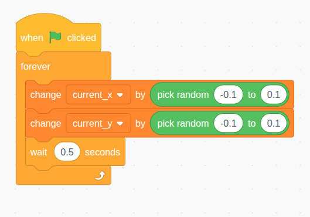

# Shared Variables
Let's create a random ocean current that moves all the fishes. We need some variables that are shared across different sprites. To do that, we put the variables inside `pysc.game`, which behaves like a Python dictionary. 

Add these lines in either `player.py` or `enemy.py`. Same as in Scratch, if the event is not related to the sprite, it doesn't matter where you put it. In this case, we are putting the event in `player.py`

```python
# create the variables
pysc.game['current_x'] = 0
pysc.game['current_y'] = 0

def ocean_current_change():
    # slowly change the current variables every 0.5 second
    while True:
        pysc.game['current_x'] += pysc.random_number(-0.1, 0.1)
        pysc.game['current_y'] += pysc.random_number(-0.1, 0.1)
        yield 0.5

# option 1: create the event as usual (the event will be removed when the player is removed)
player.when_game_start().add_handler(ocean_current_change)

# option 2: the event will not be removed when the player is removed.
# pysc.game.when_game_start().add_handler(ocean_current_change)
```
<details open markdown="block">
  <summary>
    Analogous Scratch Code
  </summary>
  
</details>


Now add this event to `enemy.py`
```python
def ocean_current_movement(clone_sprite):
    while True:
        clone_sprite.x += pysc.game['current_x'] 
        clone_sprite.y += pysc.game['current_y'] 
        yield 1/60

enemy.when_started_as_clone().add_handler(ocean_current_movement)
```
<details open markdown="block">
  <summary>
    Analogous Scratch Code
  </summary>
  
</details>


And add this event to `player.py`

```python
def ocean_current_movement():
    while True:
        player.x += pysc.game['current_x'] 
        player.y += pysc.game['current_y'] 
        yield 1/60

player.when_game_start().add_handler(ocean_current_movement)
```
<details open markdown="block">
  <summary>
    Effect
  </summary>
  
</details>

